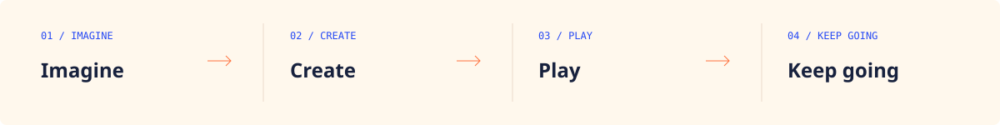

  <a href="README.md">简体中文</a> · <b>English</b>

  

 

### Good ideas deserve to be played.

**OpenAIGames is an open-source community for making games with AI.**

We turn ideas into playable games together, then share demos and honest playtest feedback. We open up the making process, learn from recurring problems, and gradually build our own AI creation tools.

**[Bring an idea ↗](https://github.com/openaigames/community/issues/new?template=01-game-idea.yml)** · **[Share a playable demo ↗](https://github.com/openaigames/community/issues/new?template=02-game-demo.yml)** · [Join the community](https://github.com/openaigames/community)

A website for showcasing and playing demos and games is under development. Stay tuned.

 

<table>
  <tr>
    <td width="33%" valign="top">
      01 / GAMES
      <h3>Make games together</h3>
      
Start with a small mechanic. Turn a wild idea into something people can actually play.

    </td>
    <td width="33%" valign="top">
      02 / COMMUNITY
      <h3>Play. Share. Iterate.</h3>
      
Share demos and honest feedback. Give someone else a starting point to build on.

    </td>
    <td width="33%" valign="top">
      03 / BUILD
      <h3>Build our own tools</h3>
      
Find the friction in making real games, then develop AI tools that make creating easier.

    </td>
  </tr>
</table>

 

### It starts with an idea

  

Code, art, stories, sound — or simply a love of playing games. There is more than one way to be part of making something.

- **Bring an idea:** describe the experience you want someone to have.
- **Make the first version:** one playable mechanic is a great place to start.
- **Leave something to build on:** code, a making-of note, or specific playtest feedback.

When sharing a demo, include a playable link, the core mechanic, and the one thing you most want feedback on. No finished game yet? A clear idea is enough to start.

Already have organized material? [Contribute ideas, demos, and tool needs through a PR](https://github.com/openaigames/community/blob/main/CONTRIBUTING.en.md). Merged records live in the community repository, with version history and discussion preserved as they evolve.

 

---

  <b>Start with play. Stay open. Keep creating.</b> 
  MAKE SOMETHING WORTH PLAYING.

