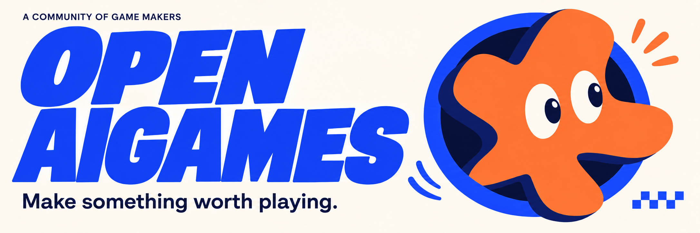
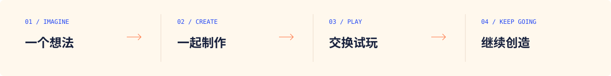

  <b>简体中文</b> · <a href="README.en.md">English</a>

  

 

### 好玩的想法，值得被做出来。

**OpenAIGames 是一个围绕 AI 与游戏创作的开源社区。**

先一起把点子做成能玩的游戏，再通过 Demo 交换真实反馈。把制作过程公开，把反复遇到的问题积累下来，逐步做成我们自己的 AI 创作工具。

**[带一个点子来 ↗](https://github.com/openaigames/community/issues/new?template=01-game-idea.yml)**　·　**[提交可试玩 Demo ↗](https://github.com/openaigames/community/issues/new?template=02-game-demo.yml)**　·　[进入共创社区](https://github.com/openaigames/community)

Demo 和游戏展示网页正在开发中，敬请期待。

 

<table>
  <tr>
    <td width="33%" valign="top">
      01 / GAMES
      <h3>一起做游戏</h3>
      
从一个小玩法出发，把脑洞变成可以亲手体验的作品。

    </td>
    <td width="33%" valign="top">
      02 / COMMUNITY
      <h3>一起玩，一起改</h3>
      
展示 Demo，交换真实反馈，让一个人的想法被更多人接着创造。

    </td>
    <td width="33%" valign="top">
      03 / BUILD
      <h3>做自己的创作工具</h3>
      
从实际制作中发现问题，逐步研发让游戏创作更顺手的 AI 工具。

    </td>
  </tr>
</table>

 

### 从一个想法开始

  

无论你擅长程序、美术、叙事、声音，还是单纯喜欢玩游戏，都可以成为创作的一部分。

- **带一个点子来**：说清楚你想做怎样的体验。
- **把第一版做出来**：一个能玩的核心玩法，就是好的开始。
- **留下一点可继续的东西**：代码、制作记录，或一次具体的试玩反馈。

提交 Demo 时，带上试玩链接、核心玩法，以及你最希望获得的一条反馈。还没有成品也没关系，一个清楚的点子就可以开始。

已有整理好的资料，也可以[通过 PR 留存点子、Demo 和工具需求](https://github.com/openaigames/community/blob/main/CONTRIBUTING.md)。合并后进入社区仓库，后续更新保留版本历史与讨论记录。

 

---

  <b>好玩是起点。开放，让创作继续。</b> 
  MAKE SOMETHING WORTH PLAYING.

